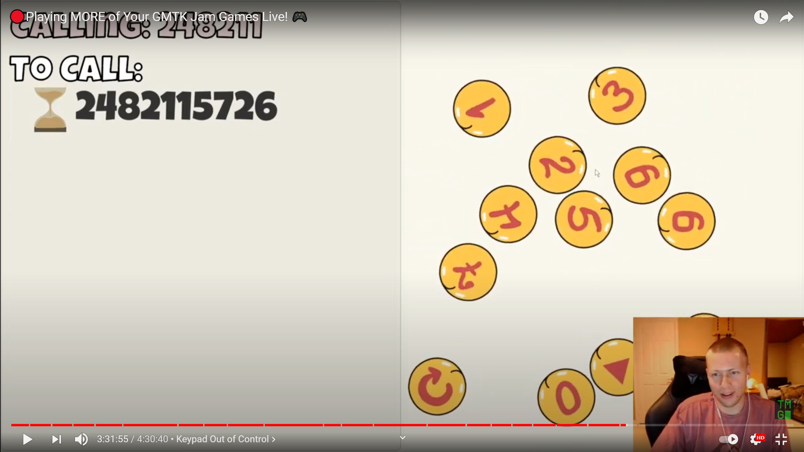
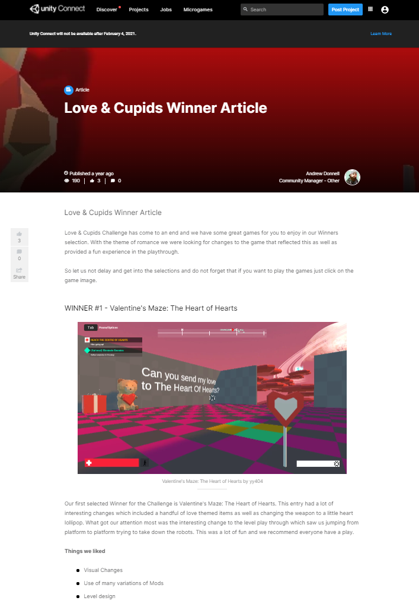

# Game Jams

## Overview

Home Page: [https://yy404.itch.io/](https://yy404.itch.io/)

Participated in:
* Brackeys Game Jam 2020.2
* Geta Game Jam 12
* GMTK Game Jam 2020 
* Ludum Dare 46
* Unity "Love & Cupids" Challenge

## [Brackeys Game Jam 2020.2: "Melody Questions"](https://yy404.itch.io/melody-questions)
2D puzzle game for ear training (code/design)

## [Geta Game Jam 12: "Egg Rescue"](https://yy404.itch.io/egg-rescue)
3D physics-based egg carrying game (code/design)

## [GMTK Game Jam 2020: "Keypad Out of Control"](https://yy404.itch.io/keypad-out-of-control)
2D physics-based phone dialling game (code/design)

***Played by the Youtuber "Turbo Makes Games" (Video)***

## [Ludum Dare 46: "KEEP IT ALIVE"](https://ldjam.com/events/ludum-dare/46/keep-it-alive-49)
3D casual game (inspired by the ["Create with Code"](https://learn.unity.com/course/create-with-code) course)

## [Unity "Love & Cupids" Challenge: "Valentine's Maze: The Heart Of Hearts"](https://play.unity.com/mg/fps/valentine-s-maze-the-heart-of-hearts)
3D maze for FPS Microgame Template (mod)

## [Global Game Jam 2020: "My Plate (Board Game)"](https://globalgamejam.org/2020/games/my-plates-4)

